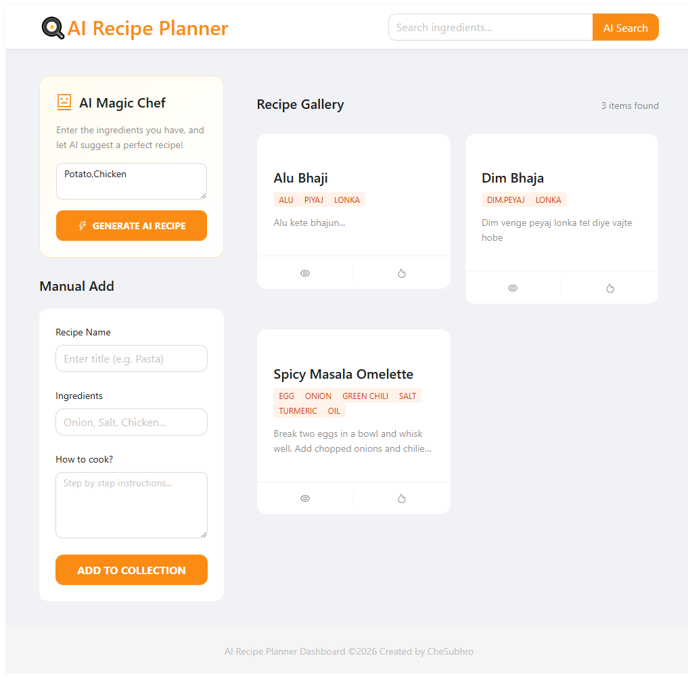
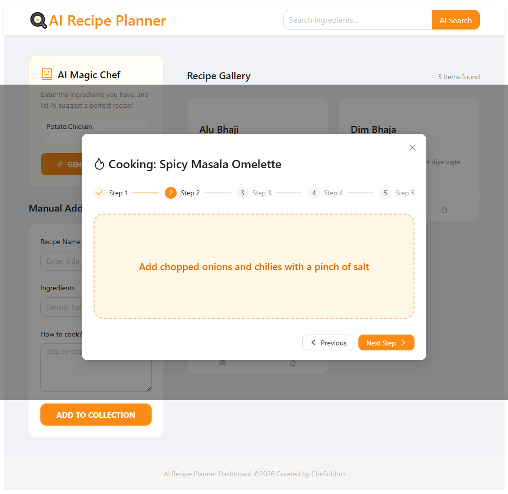

# 🍳 AI Magic Chef - Recipe Planner

AI Magic Chef is a full-stack web application that helps users generate delicious recipes based on the ingredients they have at home. Using the power of **Google Gemini AI**, the app suggests creative dishes and automatically saves them for future reference.

---

## ✨ Features

- 🤖 **AI Recipe Generation**: Enter your ingredients and get professional recipes instantly.
- 💾 **Auto-Save to DB**: Every AI-generated recipe is automatically stored in MongoDB.
- 🔍 **Smart Search**: Filter through your saved recipes by ingredients.
- 📱 **Modern UI**: Built with Ant Design for a polished and responsive experience.
- ⚡ **Fast Backend**: Powered by FastAPI for high-performance API handling.

---


## 🖼️ Project Screenshots

<p align="center">
  
  <br/>
  <i>User Interface & Ingredient Input</i>
</p>

<p align="center">
  
  <br/>
  <i>AI Generated Recipe Result</i>
</p>

<p align="center">
  
  <br/>
  <i>Saved Recipes Gallery</i>
</p>

---

## 🛠️ Tech Stack

**Frontend:**
- React.js
- Ant Design (UI Components)
- Axios (API Calls)

**Backend:**
- Python & FastAPI
- Google Gen AI SDK (Gemini 1.5 Flash)
- Motor (Async MongoDB Driver)
- Pydantic (Data Validation)

**Database:**
- MongoDB Atlas (Cloud)

---

## 🚀 Getting Started

### 1. Clone the repository
```bash
git clone [https://github.com/CheSubhro/ai-recipe-planner.git](https://github.com/CheSubhro/ai-recipe-planner.git)
cd ai-recipe-planner

Backend Setup
Navigate to the backend folder:

Bash
cd backend
Install dependencies:

Bash
pip install -r requirements.txt
Create a .env file and add your keys:

Code snippet
MONGO_DETAILS=your_mongodb_uri
GEMINI_API_KEY=your_gemini_api_key
Run the server:

Bash
uvicorn main:app --reload
Frontend Setup
Navigate to the frontend folder:

Bash
cd frontend
Install dependencies:

Bash
npm install
Run the development server:

Bash
npm run dev
📝 License
This project is for educational purposes as part of a Fullstack Development learning journey.

👨‍💻 Author
CheSubhro

GitHub: @CheSubhro
